# Bolsa_Empleos_Capacitaciones-IA
Bolsa de Empleos con capacitaciones integradas usando inteligencia artificial, para jóvenes inexpertos  

## Capturas de Pantalla

### Flujo del Candidato (Joven)

#### 1. Registro de Candidato
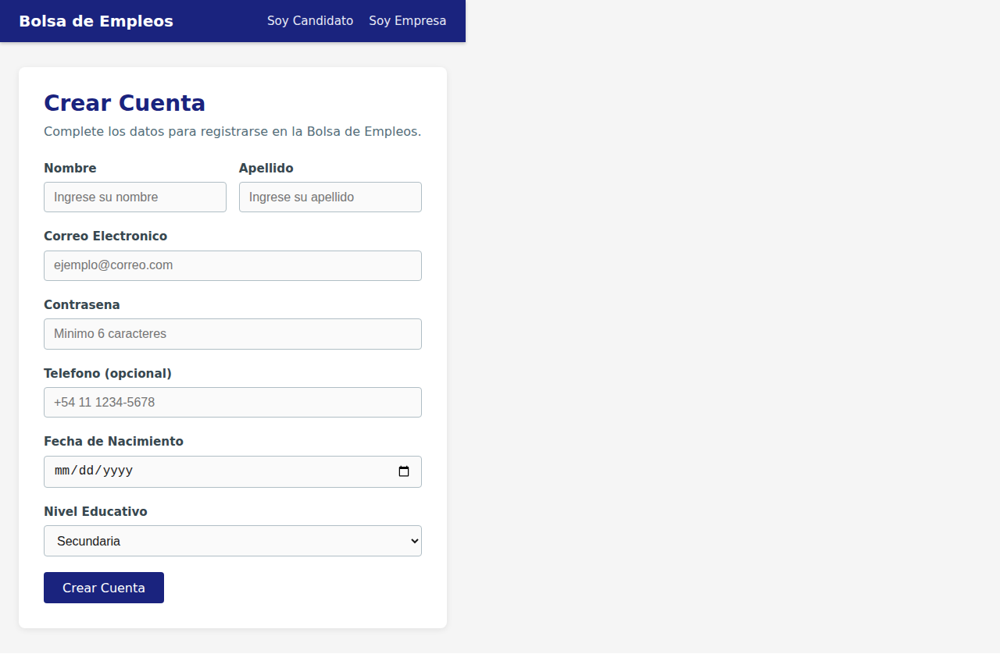

#### 2. Creación de Curriculum
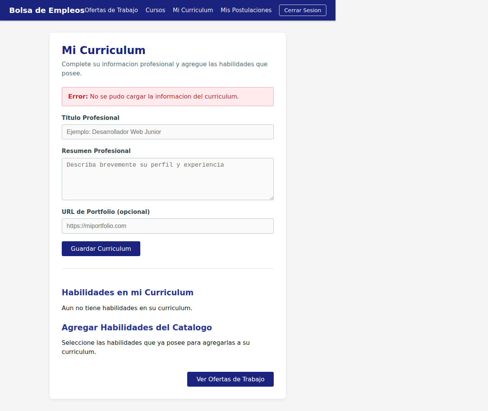

#### 3. Lista de Ofertas de Trabajo
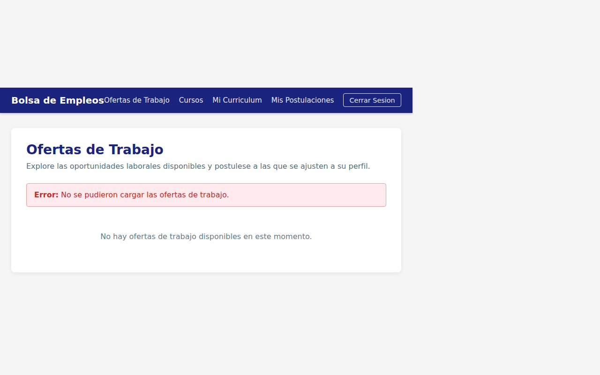

#### 4. Detalle de Oferta y Postulación
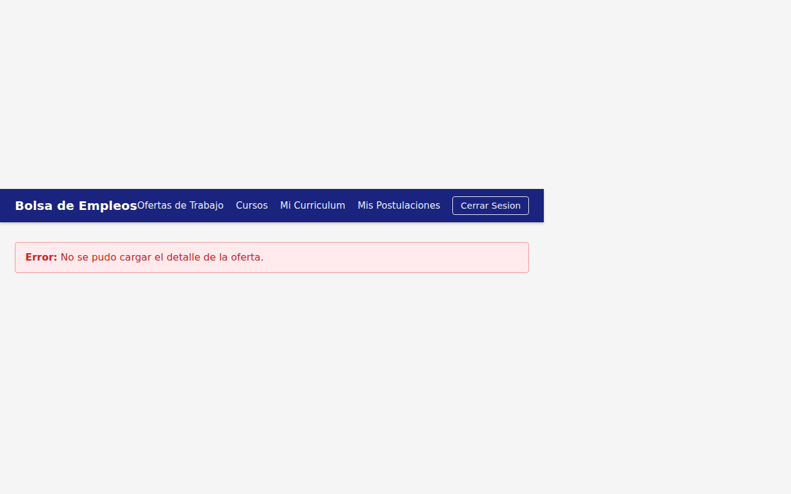

#### 5. Mis Postulaciones
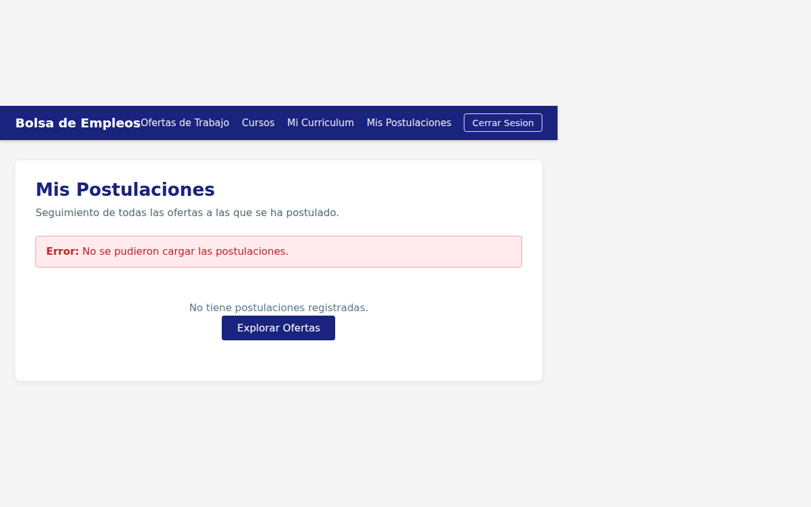

#### 6. Lista de Cursos de Capacitación
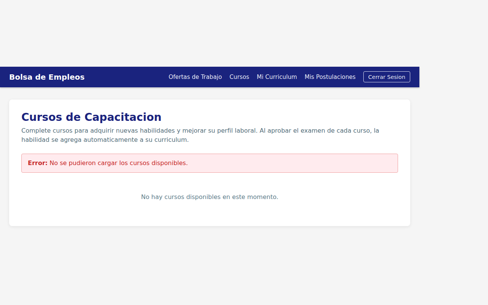

#### 7. Examen de Curso
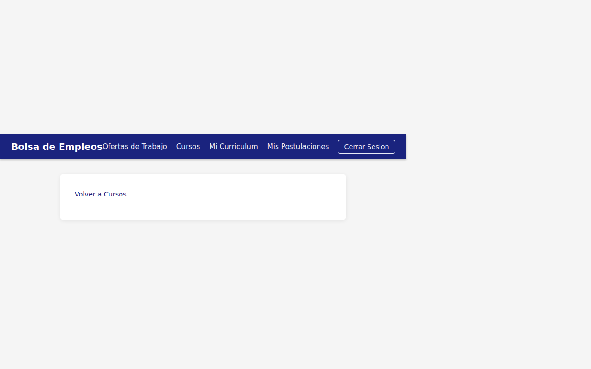

---

### Flujo de Empresa

#### 8. Registro de Empresa
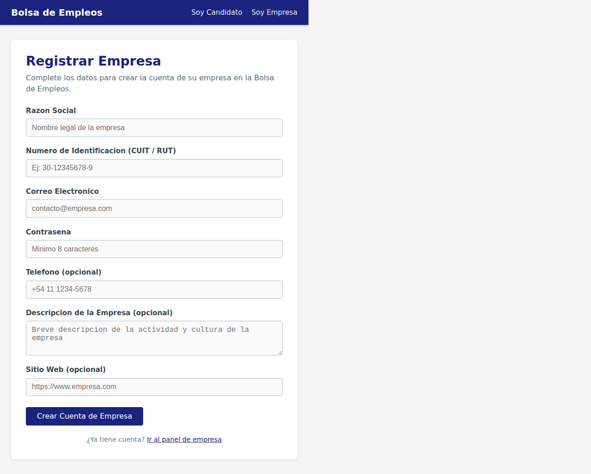

#### 9. Gestión de Ofertas
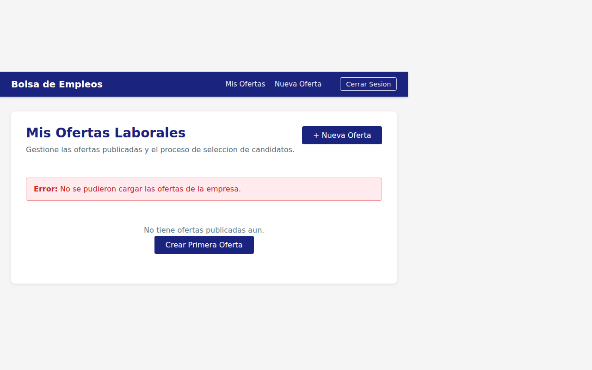

#### 10. Creación de Oferta de Trabajo
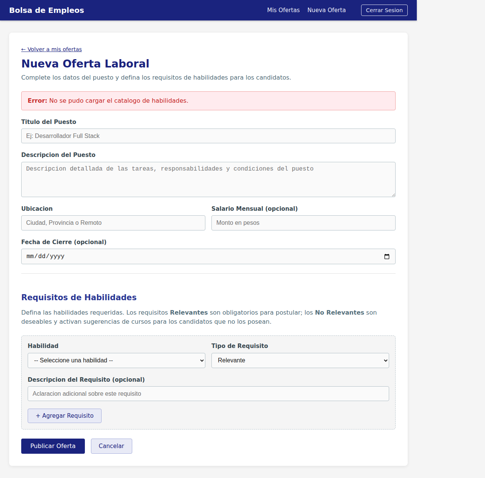

#### 11. Candidatos Filtrados
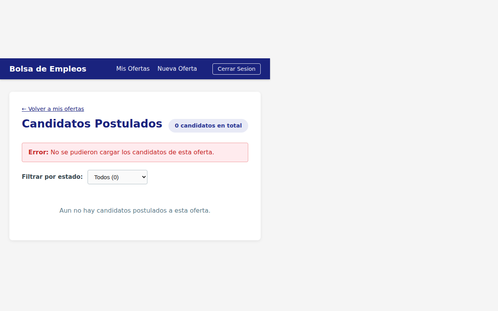

#### 12. Feedback al Postulante
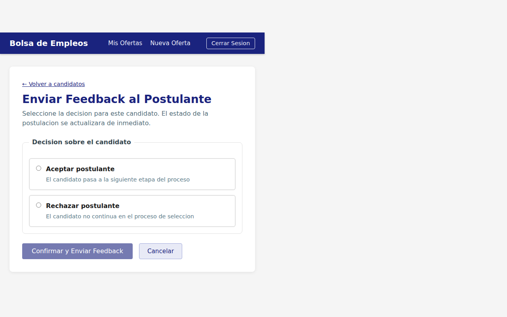
